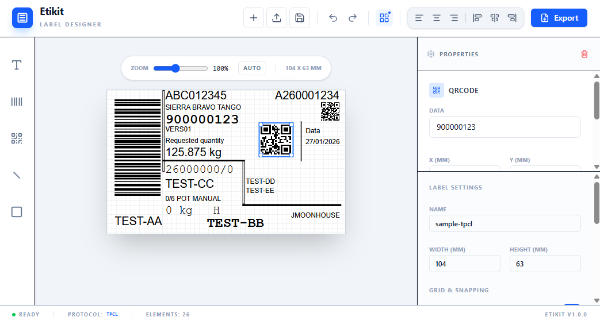

# Etikit



Etikit is a minimalistic, web-based application designed for creating and formatting labels. It supports both TPCL and ZPL label formats with high precision.

## Features

- **Visual Label Designer**: A simple and intuitive drag-and-drop interface for designing labels.
- **Precision Alignment Tools**: Align and distribute elements with pixel-perfect precision.
- **Snap to Grid**: Customizable grid for precise element placement.
- **History Management**: Full Undo and Redo support for all editor actions.
- **Element Support**: Add text, lines, rectangles, barcodes, and QR codes.
- **Printer Integration**: Generates printer-ready code for TPCL and ZPL specifications.
- **Template Management**: Save/load designs as JSON templates and import/export printer-ready files.
- **Label Size Presets**: Choose from common industrial sizes or set custom dimensions.
- **Modern UI**: Streamlined interface with integrated protocol indicators.

## Getting Started

### Prerequisites

- [Node.js](https://nodejs.org/) (latest LTS recommended)

### Installation

1. Clone the repository:
   ```bash
   git clone <repository-url>
   cd etikit
   ```

2. Install dependencies:
   ```bash
   npm install
   ```

3. Start the application:
   ```bash
   npm run dev
   ```

## Usage

- **Creating**: Click the **+** (New) button to start a new label.
- **Designing**: Add elements from the left toolbar and drag them onto the label.
- **Precision**: Use the alignment buttons in the top bar or toggle the grid.
- **Editing**: Use the right sidebar to adjust properties like content, font, and rotation.
- **Managing**: Use **Load** to import files and **Save** to store templates.
- **Exporting**: Click **Export** to generate the printer-ready file (ZPL or TPCL).

## Disclaimer

TPCL and ZPL are proprietary protocols developed by TEC® and Zebra Technologies respectively. This project is not affiliated with or endorsed by TEC® or Zebra Technologies.
