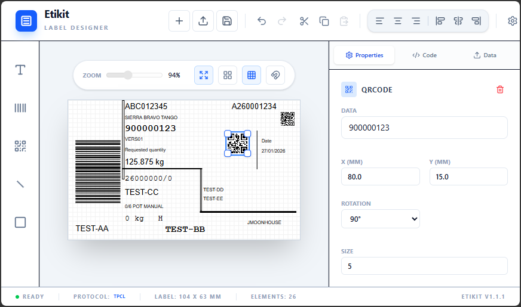

# Etikit



Etikit is a browser-based label designer that creates printer-ready files for Toshiba TPCL and Zebra ZPL printers.

## Features

- Design labels with text, lines, rectangles, barcodes, and QR codes.
- Set label dimensions in millimeters or choose a preset when creating a label.
- Adjust element content, position, rotation, size, fonts, and barcode type in the Properties panel.
- Align selected elements and distribute groups of three or more from the top toolbar.
- Configure grid visibility, snapping, grid size, DPI, quantity, speed, and darkness from Application Settings.
- Use undo/redo, cut/copy/paste, and Delete/Backspace shortcuts; hover over the related toolbar or delete buttons to see their shortcuts.
- See a warning when elements extend beyond the label boundary and may be clipped when printed.
- Recover the last label from a browser-local draft after reopening the app; CSV data must be imported again.
- Preview generated TPCL or ZPL code, copy it, or download the printer file.
- Save templates as JSON and open JSON, TPCL (`.etec`), or ZPL (`.ezpl`) files.
- Import CSV data, preview records, insert column placeholders into text/barcode/QR content, and download a batch print file.
- Zoom manually or use Auto to fit the label in the editor.

## Requirements

- Node.js (latest LTS recommended)
- npm

## Getting Started

Clone the repository and install dependencies:

```bash
git clone https://github.com/flashmood69/etikit.git
cd etikit
npm install
```

Start the development server:

```bash
npm run dev
```

Create a production build with `npm run build`. To serve the build locally, run `npm run preview`.

## Usage

1. Select **New Label** to name the label and choose its printer protocol, DPI, and size preset.
2. Add elements from the left toolbar. Select an element to edit its properties; click an empty area of the label or editor to return to label name and dimensions.
3. Use the top toolbar to align elements, toggle snapping, and access Application Settings for grid and print options.
4. Open the **Code** panel to preview generated output, copy it, or download a TPCL (`.etec`) or ZPL (`.ezpl`) file.
5. Use **Save Template** to download a JSON template. Use **Load Template** to open a JSON template or supported TPCL/ZPL file.

### CSV Batch Printing

In text, barcode, or QR content, use a placeholder matching a CSV column name, such as `{{ProductCode}}`. Open the **Data** panel to import a CSV and preview its records. Insert a CSV field from the Properties panel, then select **Download Batch** to generate one printer file containing the records.

## Disclaimer

TPCL (TEC Printer Control Language) is a printer language used by Toshiba Tec printers. ZPL (Zebra Programming Language) is a printer language associated with Zebra Technologies. Etikit is an independent project and is not affiliated with or endorsed by Toshiba Tec Corporation or Zebra Technologies Corporation. All company names and trademarks belong to their respective owners.
